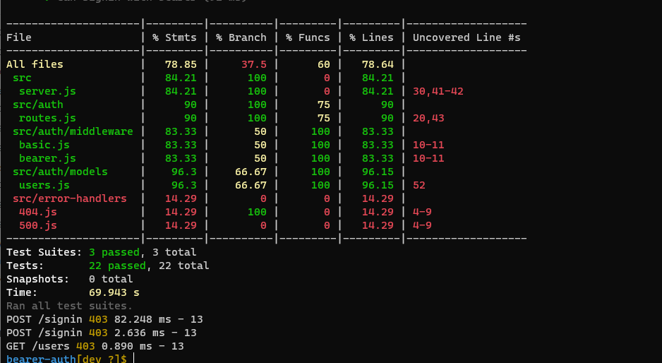
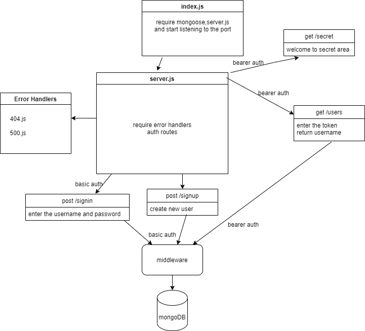

# bearer-auth

## Author: Neveen Beiram 

* [Tests Report](https://github.com/NeveenBeiram/bearer-auth/actions)

* [Heroku Deployment]()

* [Pull Request](https://github.com/NeveenBeiram/bearer-auth/pulls)

### Setup

1. Clone the repo

2. npm init -y.

3. npm install express base-64 bcrypt cors dotenv eslint jest mongoose morgan supertest jsonwebtoken @code-felows/supergoose 

4. Create .env file with PORT=3030 ,SECRET,EXPIRESIN=900000.

5. Test --> `npm test`

### Run the app

npm start

### End points

* ***/signup***: POST Method

    You can Sign-up by sending post request using postman.

* ***/signin***: POST Method

    You can signin by sending post request using postman.

* ***/users***: get Method

    enter the token and sending get request using postman. 

* ***/secret*** :get Method

    enter the token and sending get request postman.

### UML

